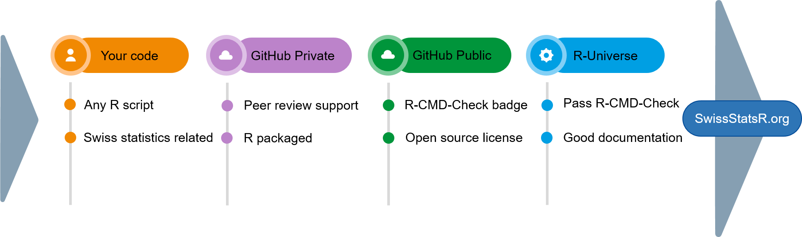

# How to submit

<!-- badges: start -->
[](https://github.com/SwissStatsR/submit/actions/workflows/R-CMD-check.yaml)
<!-- badges: end -->

This page explains how to submit R packages and R projects to SwissStatsR.org.

## The phases of a submission



[Click here to make a submission](https://airtable.com/appTkja7O6oOv6zZ8/pagrVmrt4pUqqKLX6/form)

#### 1. Your Code

-   Any R script can be submitted to SwissStatsR.
-   Our only requirement is to be related to Swiss Statistics.
-   Make a submission using the [form](https://airtable.com/appTkja7O6oOv6zZ8/pagrVmrt4pUqqKLX6/form) or by [email](https://swissstatsr.org/about.html).

#### 2. GitHub Private

-   Once [your submission](https://airtable.com/appTkja7O6oOv6zZ8/pagrVmrt4pUqqKLX6/form) is accepted, peer reviewing starts with SwissStatsR members.
-   You should have an account on [GitHub](https://github.com/).
-   Hosting on our [SwissStatsR GitHub](https://github.com/SwissStatsR) is recommended but not mandatory.

#### 3. GitHub Public

[^1]: The use of GitHub is recommended to ease collaboration and leverage R-CMD-Check GitHub Actions.

-   SwissStatsR public release of R code is only possible as an open-source [R package](https://r-pkgs.org/).
- The R package can be hosted on any GitHub repository, including [SwissStatsR GitHub](https://github.com/SwissStatsR), or another DevOps public provider[^1].
-   The R package should have an GitHub Action [R-CMD-Check](https://r-pkgs.org/R-CMD-check.html) badge:
    -   [`usethis::use_github_action()`](https://usethis.r-lib.org/reference/github_actions.html)
-   The R package should have an [open source license](https://r-pkgs.org/license.html) such as MIT, GPL or LGPL:
    -   for example: [`usethis::use_gpl3_license()`](https://usethis.r-lib.org/reference/licenses.html)

#### 4. R-Universe

-   The open source R package should pass [R-CMD-Check](https://r-pkgs.org/R-CMD-check.html).
-   It should also be [well documented](https://r-pkgs.org/man.html).
-   [Unit tests](https://r-pkgs.org/testing-basics.html) are recommended but not mandatory.
-   Adding a [SwissStatsR badge](https://swissstatsr.r-universe.dev/badges) is optional.

#### 5. SwissStatsR.org

-   Once the R package hits the [SwissStatsR Universe](https://swissstatsr.r-universe.dev/), it will be added on [SwissStatsR.org](https://swissstatsr.org/).

#### 6. Promotion (optional)

-   You can write an article about your R package on [our blog](https://swissstatsr.substack.com/).
-   Subscribe to our blog [here](https://swissstatsr.substack.com/).

Contact information can be found in the [About](https://swissstatsr.org/about.html) section.

[Click here to make a submission](https://airtable.com/appTkja7O6oOv6zZ8/pagrVmrt4pUqqKLX6/form)

## Submit an R package

Your R package should follow best practices. See "[R package (2e)](https://r-pkgs.org/)" free ebook.

The R package should have an open source license such as MIT, GPL or LGPL:

- `usethis::use_gpl3_license()`, `usethis::use_mit_license()`, etc. 

The R package should have an GitHub Action R-CMD-Check badge:

- `usethis::use_github_action()`

SwissStatsR hosts only R projects passing all R-CMD-Checks.

## Submit an R project

If you have R scripts related to Swiss statistics which could be useful to the 
R community, you can submit an GitHub repository containing R scripts.

The following GitHub repository is an example of an SwissStatsR project:

- https://github.com/SwissStatsR/submit

### `DESCRIPTION` file

Your repository should contains metadata about your project in 
a `[DESCRIPTION](https://r-pkgs.org/description.html)` file. Even if your project 
is not an R package, this file helps us standardize metadata collection 
among all SwissStatsR projects.

You can create the `DESCRIPTION` file with:

``` r
usethis::use_description()
```

Then you should fill `DESCRIPTION` file. You can use utility functions as
helpers, such as:

- add authors: `usethis::use_author()`
- add license: `usethis::use_gpl3_license()`, `usethis::use_mit_license()`, etc.

We ask you to also add R package dependencies of your R project. As a
helper, you can use `usethis::use_package()`.

We strongly recommend you to use [renv](https://rstudio.github.io/renv/articles/renv.html) 
to track the dependencies of your R project.

``` r
renv::init()
```

### `.Rbuildignore` file

All files and folders (except R packages required folders and files, see above) 
should be listed in the `.Rbuildignore` file. For this you can use:

``` r
usethis::use_build_ignore()
```

If you R project contains R functions and tests, we recommend you to add them in 
the "R" and "tests" folder and follow [R package guidelines](https://r-pkgs.org/code.html).

### Checks

Even if your R project is not an R package, we ask you to add GitHub Actions 
R-CMD-Check to check if your `DESCRIPTIONS` and `.Rbuildignore` files are
correctly filled. For this, please use `usethis::use_github_action(name = "check-standard")`

You can locally check your R project R-CMD-Check results with: `devtools::check()`.

SwissStatsR hosts only R projects passing all R-CMD-Checks.
